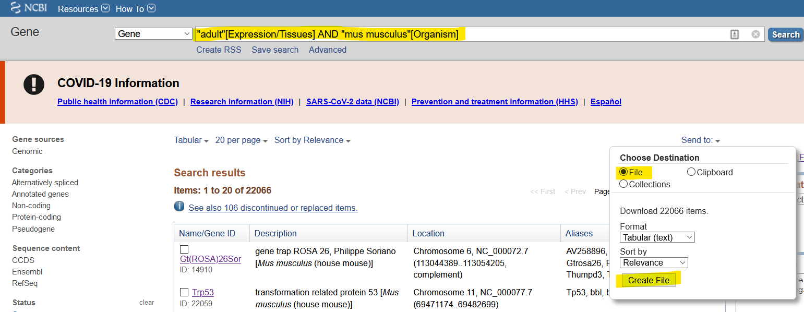
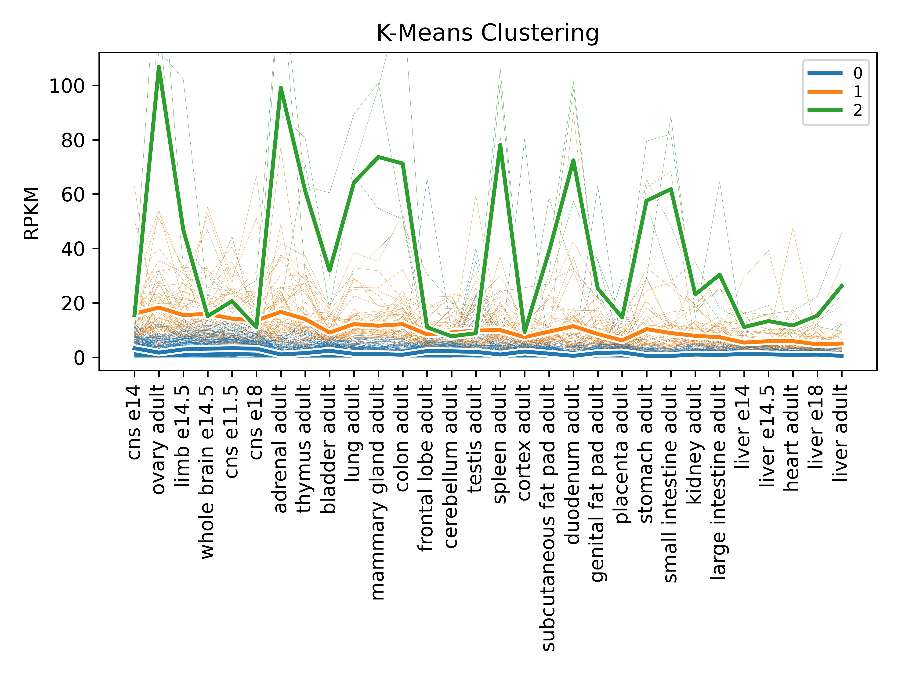
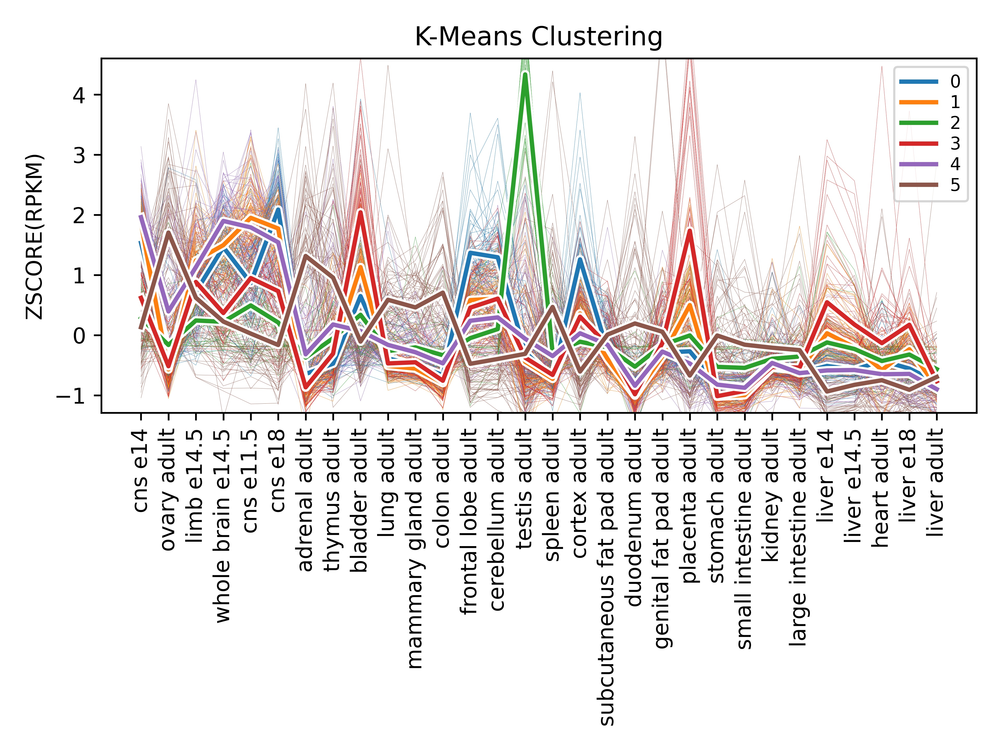

# RNA-Seeker

Exploratory RNA-Seq data collection and k-means clustering analysis.

## Installation

Clone this repository to your local machine, then install using Python.

Alternatively, simply clone and then run your scripts within the cloned folder.

```bash
git clone https://github.com/shanedrabing/rna-seeker.git
cd rna_seeker
python setup.py install
```

## Getting Started

This program takes exported search results from NCBI Gene ([here is an example
search](https://www.ncbi.nlm.nih.gov/gene/?term=%22adult%22%5BExpression%2FTissues%5D+AND+%22mus+musculus%22%5BOrganism%5D))
as input, as seen below:



Ideally, the search is species-specific and includes *something* to filter the
results to make sure it has expression-related information. In the above
example, I use the keyword "adult" which appears in many tissues types for the
house mouse.

Check out [data/mus_musculus_exp.txt](data/mus_musculus_exp.txt) as an example
of the exported results.

## Example Script

Now that we have a search results tabular file, let's use a simple Python
script to perform all three procedures (`retrieve`, `clean`, `analyze`) of the
RNA-Seeker package:

```python
from rna_seeker.core import retrieve, clean, analyze

# retrieve data from NCBI Gene
retrieve(inp_fname="mus_musculus_exp.txt",
         out_fname="raw.csv",
         include=lambda x: x["Symbol"].startswith("Zfp"))

# clean up the raw data
clean(inp_fname="raw.csv",
      out_fname="clean.csv")

# k-means clustering of cleaned data
analyze(inp_fname="clean.csv",
        out_fname="k3_rpkm.csv",
        plt_fname="k3_rpkm.jpg")
```

Notice that, besides providing necessary filenames, we use an anonymous
function as a value for the `include` parameter of the `retrieve` function.
Imagine that `x` is a dictionary representing any given row of the
[data/mus_musculus_exp.txt](data/mus_musculus_exp.txt) file. In this example,
we make sure that any given row's symbol (name) starts with `"Zfp"`, for
"Zinc-finger protein." So, our function will now only go fetch the information
of genes that match that criteria.

By default, the `analyze` function runs k-means clustering with a `k` value of
3 and no scaling. Here is an example plot of the default `analyze` function.



The above graph tells us more about how genes cluster together in terms of the
*amount* of expression. The green line is high expression, orange is medium,
and blue is low. The [associated CSV file](data/k3_rpkm.csv) will assign genes
to these clusters, so we can determine which genes have high expression, for
instance:

```csv
ID,NAME,GROUP,ASSIGNMENT,URL
[...]
12192,Zfp36l1,2,'adrenal adult|bladder adult|cns e11.5|colon adult|cortex adult|duodenum adult|frontal lobe adult|genital fat pad adult|heart adult|kidney adult|large intestine adult|limb e14.5|liver adult|liver e14|liver e14.5|liver e18|lung adult|mammary gland adult|ovary adult|placenta adult|small intestine adult|spleen adult|stomach adult|subcutaneous fat pad adult|thymus adult',https://www.ncbi.nlm.nih.gov/gene/12192
12193,Zfp36l2,2,'adrenal adult|bladder adult|cns e11.5|colon adult|cortex adult|duodenum adult|frontal lobe adult|genital fat pad adult|heart adult|kidney adult|large intestine adult|limb e14.5|liver adult|liver e14|liver e14.5|liver e18|lung adult|mammary gland adult|ovary adult|placenta adult|small intestine adult|spleen adult|stomach adult|subcutaneous fat pad adult|thymus adult',https://www.ncbi.nlm.nih.gov/gene/12193
22695,Zfp36,2,'adrenal adult|bladder adult|cns e11.5|colon adult|cortex adult|duodenum adult|frontal lobe adult|genital fat pad adult|heart adult|kidney adult|large intestine adult|limb e14.5|liver adult|liver e14|liver e14.5|liver e18|lung adult|mammary gland adult|ovary adult|placenta adult|small intestine adult|spleen adult|stomach adult|subcutaneous fat pad adult|thymus adult',https://www.ncbi.nlm.nih.gov/gene/22695
244216,Zfp771,2,'adrenal adult|bladder adult|cns e11.5|colon adult|cortex adult|duodenum adult|frontal lobe adult|genital fat pad adult|heart adult|kidney adult|large intestine adult|limb e14.5|liver adult|liver e14|liver e14.5|liver e18|lung adult|mammary gland adult|ovary adult|placenta adult|small intestine adult|spleen adult|stomach adult|subcutaneous fat pad adult|thymus adult',https://www.ncbi.nlm.nih.gov/gene/244216
```

We can get different results from the clustering algorithm if we change the `k`
value and `scaling` parameter, like so:

```py
# k-means clustering, scaled by Z-score
analyze(inp_fname="clean.csv",
        out_fname="k6_zscore.csv",
        plt_fname="k6_zscore.jpg",
        k=6, scaling="zscore")
```

And now we get results like this:



The above graph tells us more about how genes cluster together in terms of the
profile of the *tissues* they are expressed in. So, for instance, it appears
the green line has very high expression in the testis. Let's take a look at
that cluster in the [associated CSV file](data/k6_zscore.csv) to find out what
genes are expressed in the testis:

```csv
ID,NAME,GROUP,ASSIGNMENT,URL
[...]
22646,Zfp105,2,'liver adult|testis adult',https://www.ncbi.nlm.nih.gov/gene/22646
22654,Zfp13,2,'liver adult|testis adult',https://www.ncbi.nlm.nih.gov/gene/22654
22694,Zfp35,2,'liver adult|testis adult',https://www.ncbi.nlm.nih.gov/gene/22694
22696,Zfp37,2,'liver adult|testis adult',https://www.ncbi.nlm.nih.gov/gene/22696
22698,Zfp39,2,'liver adult|testis adult',https://www.ncbi.nlm.nih.gov/gene/22698
29813,Zfp385a,2,'liver adult|testis adult',https://www.ncbi.nlm.nih.gov/gene/29813
65020,Zfp110,2,'liver adult|testis adult',https://www.ncbi.nlm.nih.gov/gene/65020
66758,Zfp474,2,'liver adult|testis adult',https://www.ncbi.nlm.nih.gov/gene/66758
68271,Zfp85os,2,'liver adult|testis adult',https://www.ncbi.nlm.nih.gov/gene/68271
72020,Zfp654,2,'liver adult|testis adult',https://www.ncbi.nlm.nih.gov/gene/72020
74400,Zfp819,2,'liver adult|testis adult',https://www.ncbi.nlm.nih.gov/gene/74400
75424,Zfp820,2,'liver adult|testis adult',https://www.ncbi.nlm.nih.gov/gene/75424
98403,Zfp451,2,'liver adult|testis adult',https://www.ncbi.nlm.nih.gov/gene/98403
101197,Zfp956,2,'liver adult|testis adult',https://www.ncbi.nlm.nih.gov/gene/101197
105590,Zfp957,2,'liver adult|testis adult',https://www.ncbi.nlm.nih.gov/gene/105590
109910,Zfp91,2,'liver adult|testis adult',https://www.ncbi.nlm.nih.gov/gene/109910
228913,Zfp217,2,'liver adult|testis adult',https://www.ncbi.nlm.nih.gov/gene/228913
232976,Zfp574,2,'liver adult|testis adult',https://www.ncbi.nlm.nih.gov/gene/232976
233905,Zfp646,2,'liver adult|testis adult',https://www.ncbi.nlm.nih.gov/gene/233905
240186,Zfp438,2,'liver adult|testis adult',https://www.ncbi.nlm.nih.gov/gene/240186
278304,Zfp385c,2,'liver adult|testis adult',https://www.ncbi.nlm.nih.gov/gene/278304
338354,Zfp780b,2,'liver adult|testis adult',https://www.ncbi.nlm.nih.gov/gene/338354
433791,Zfp992,2,'liver adult|testis adult',https://www.ncbi.nlm.nih.gov/gene/433791
545938,Zfp607a,2,'liver adult|testis adult',https://www.ncbi.nlm.nih.gov/gene/545938
666528,Zfp541,2,'liver adult|testis adult',https://www.ncbi.nlm.nih.gov/gene/666528
100038371,Zfp389,2,'liver adult|testis adult',https://www.ncbi.nlm.nih.gov/gene/100038371
100416830,Zfp572,2,'liver adult|testis adult',https://www.ncbi.nlm.nih.gov/gene/100416830
100503000,Zfp993,2,'liver adult|testis adult',https://www.ncbi.nlm.nih.gov/gene/100503000
[...]
```

It should be stated that tweaking the clustering algorithm is more of an art
than a science, and the results are more interpretive than empirical. Have fun
exploring the transcriptome!

## To-Do

This program is not robust. You will experience errors and poor traceback
information currently. I need to make the program able to handle more erroneous
inputs, like empty files or not finding proper keys while retrieving
information.

## License

[MIT](https://choosealicense.com/licenses/mit/)
